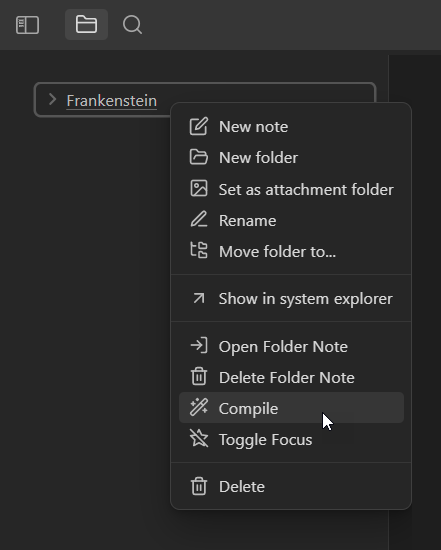

# LitMojo Plugin for Obsidian

LitMojo is an Obsidian plugin with for serious writers. Our vision is to release new features over time that empower Obsidian users with mojo goody-goodness for writing and publishing. Our first feature is the Manuscript Compiler, available now for beta testing. It is not yet available in the Obsidian Community Plugins, but can be installed using the Obsidian [BRAT](https://github.com/TfTHacker/obsidian42-brat) (Beta Reviewers Auto-update Tester) plugin.

## Manuscript Compiler

The Manuscript Compiler allows you to compile multiple markdown documents into a single manuscript in Markdown or HTML.


### Manuscript Compiler User Guide

#### Step One: Configure Compiler Settings

Create a folder note inside the folder containing documents to compile. A "folder note" is a Markdown document that is named the same as the parent folder. Configure the compile settings for a given manuscript in the YAML frontmatter of the folder note as shown below:

```yaml
---
litmojo:
  title: "Frankenstein by Mary Shelley"
  path: TestContent/Compile/Frankenstein.md,
  exclude:
    headings:
      - "Heading Title for Section to Exclude 1"
      - "Heading Title for Section to Exclude 2"
---
```

- **litmojo.title** - *optional*; used when the compile type is `.html`, sets the HTML document title (when no explicitly defined the name of the manuscript folder note will be used).
- **litmojo.path** - *required*; is where you define the file path for the compiled manuscript. You must manually create any folders in the specified path if they do not exist. The file extension determines the type of file that will be created. At this time, only `.md` for Markdown and `.html` for HTML are supported. You can create a PDF from the compiled manuscript using Obsidian's native Export to PDF feature.
- **litmojo.exclude** - *optional*; defines sections to exclude. Supports a string array of one or more heading titles. Any section with a heading that has a matching title will be ommited from the compilation.

#### Step Two: Configure Individual Documents

Each Markdown document in a manuscript folder must have YAML frontmatter like this:

```yaml
---
litmojo:
  order: 5
  compile: true
---
```

- **litmojo.order** - a number that specifies the order in which the document will be inserted in the compiled manuscript. We recommend using increments of 5 or 10 so that you will have a little available space to insert pages in between two others without having to modify the order of remaining pages.
- **limojo.compile** - a boolean value (`true`|`false`) that specifies whether or not the given page should be included in the manuscript when compiled. 

#### Step Three - Compile

Right-click on your manuscript folder and choose Compile. Your manuscript will be compiled into the file specified by the path you gave in the frontmatter of the manuscript's folder note.



#### Tips

- If you want to see HTML manuscripts in Obsidian's file explorer after they've been compiled, you must configure Obsidian to detect all file extensions. In Settings under Files and Links, turn on Detect all File Extensions.
- Images should be defined in Markdown, not wiki style:
	- Like This: ``
	- Not this: `![[image.jpg]]`
- When compiling to HTML, image src paths in the manuscript may need to be manually edited to create proper relative or fully qualified URLs (sorry; we'll fix this soon).

## Other Documentation

- [Developer Guide](developer-guide/developer-guide.md)
